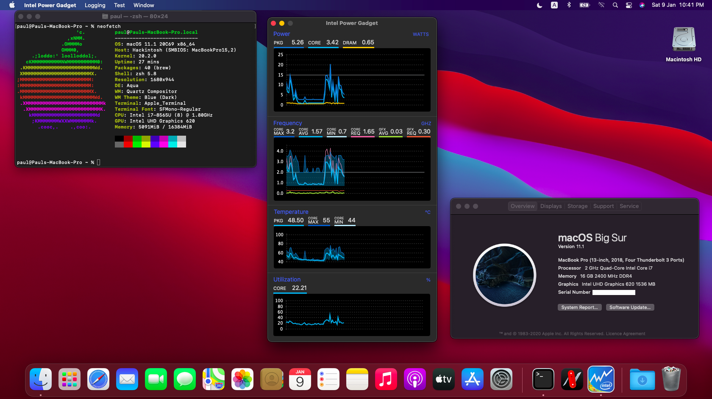

# Lenovo Thinkpad E490 Hackintosh

    

## System configuration

| Model     | MacBookPro15,2      | Version        | Catalina 10.15.7/Big Sur 11.0.1      |
| :-------- | :------------------ | :------------- | :------------------ |
| Processor | Intel Core i7-8565U | Graphics       | UHD Graphics 620    |
| Memory    | 2666MHz 2x8GB  | OS Disk        | Crucial MX500 (SATA) (should work with M.2 SSD included with laptop) |
| Audio     | Conexant CX8070     | WiFi/Bluetooth | Intel Wireless AC9260(default card)|

## About build

- Since the other Repos for the Lenovo E490 are very outdated I released my own version.
- Intel wifi card works with AirportItlwm.kext:
  - Follow this: https://openintelwireless.github.io

#### Performance

- [Geekbench 5](https://browser.geekbench.com/v5/cpu/5792498): 812 SingleCore, 2972 MultiCore
- Battery: Haven't tested yet, battery status with patched DSDT but might not work with your PC

#### Not Working

- Things that may never work:
  - The Fn row functions except volume control
  - DRM (for Netflix and AppleTV+)
  - HDMI Port (USB-C works but no video output)

## Installation

### BIOS

- Disk in `AHCI` mode
- Secure Boot `Disabled`

### STEP

> You can follow [Dortania's guide](https://dortania.github.io/OpenCore-Install-Guide/) as it is very detailed and easy to understand.

#### TL;DR

- Prepare an Mac installer in USB with [GibMacOS](https://dortania.github.io/OpenCore-Install-Guide/installer-guide/)
- Go to the [releases](https://github.com/jamieernest/Lenovo-E490-Hackintosh/releases) and download the lastest version
- Replace EFI folder in USB EFI partition with the EFI folder from the zip file
- Go into config.plist with [ProperTree](https://github.com/corpnewt/ProperTree) and change the SystemProductName (Type), SystemSerialNumber (Serial), MLB (Board Serial) and SystemUUID (SmUUID) which is generated using [GenSMBIOS.](https://github.com/corpnewt/GenSMBIOS) (Press 1, then 3 then type MacBookPro15,2)
- If the DSDT doesn't work (aka no boot) remove the DSDT from the ACPI folder and open config.plist with ProperTree and press Ctrl+Shift+R and select the OC Folder.
- Boot into USB and select MacOS installer
- In the installer open disk utility and format the SSD to APFS. <strong>YOU WILL LOSE ALL THE DATA THAT IS ON IT</strong> 
- When you are booted in you need to mount EFI partition and replace it with USB's EFI using [Hackintool](https://github.com/headkaze/Hackintool/releases) or [MountEFI](https://github.com/corpnewt/MountEFI)

#### Sleep
Sleep is completely supported!

## Credits

- [Apple](https://apple.com/) for MacOS
- [acidanthera](https://github.com/acidanthera) for providing almost all kexts and drivers
- [corpnewt](https://github.com/corpnewt) for [GibMacOS](https://github.com/corpnewt/gibMacOS), [GenSMBIOS](https://github.com/corpnewt/GenSMBIOS) and [MountEFI](https://github.com/corpnewt/MountEFI)
- [Dortania](https://github.com/dortania) for the [guides](https://dortania.github.io/OpenCore-Install-Guide/)
- [headkaze](https://github.com/headkaze) for providing the very useful [Hackintool](https://github.com/headkaze/Hackintool/releases)
- all other authors that mentioned or not mentioned in this repo
-  and [you](https://cdn.weeb.sh/images/rJl3BcTuG.gif) for reading/following/using this :D
